
<h1 align="center">社区网格化管理平台的构建</h1>

## 简介
社区网格化管理平台：基于Spring Boot构建，角色分为管理员、用户；提供试题管理、意见反馈、问卷调查、用户注册与管理、网格与任务管理等功能，提升社区服务与管理效率。    --计算机毕业设计源码；毕设源码；java毕业设计源码

## 联系方式

<h3 align="center">获取完整代码与数据库文件 + 微信：deepguan QQ: 86050149 QQ群: 783742310</h3>

<h3 align="center">可帮忙远程部署 包运行成功！提供远程部署、修改代码、设计文档指导、代码讲解等服务！</h3>

## 功能介绍（完整见运行截图）
管理员：社区网格化管理平台提供多种管理工具，管理员可以进行用户和题库管理，包括添加、修改和删除居民信息及考试题目。管理员可访问系统的公告、意见反馈管理，进行网格信息的展示和事件上报，支持高效的社区任务分配与跟踪。此外，数据收集和分析功能使得资源配置更优化，管理者能精准决策。

用户：用户可通过平台进行个人信息的注册和修改，包括上传头像、更新联系方式等。平台允许用户参与问卷调查和在线考试，提供便捷的答题与提交功能。此外，用户可以查看自己所在小区的信息、留言与反馈情况，并参与社区交流和互动，了解社区公告及最新政策。个人中心方便用户管理自己的数据和查看历史记录。

## 运行截图

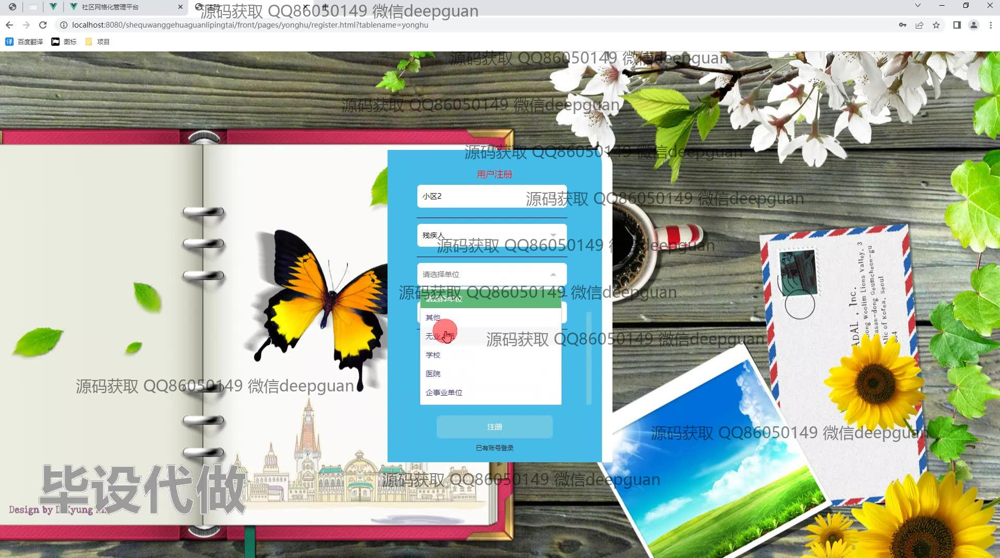
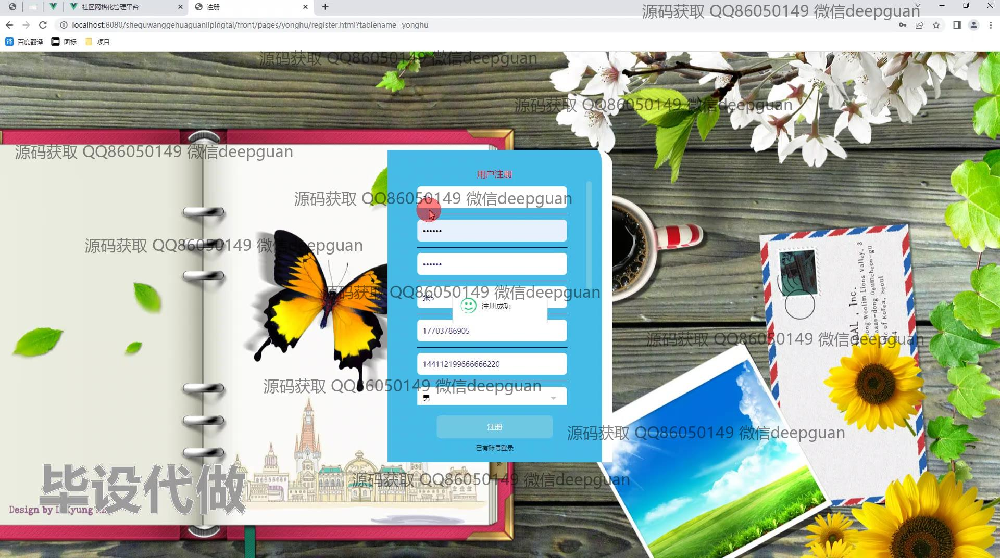
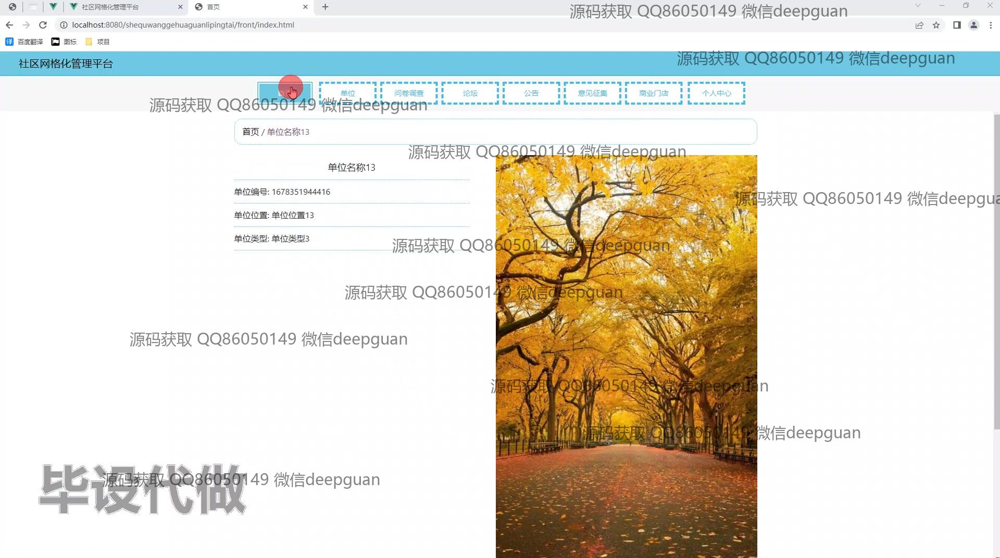
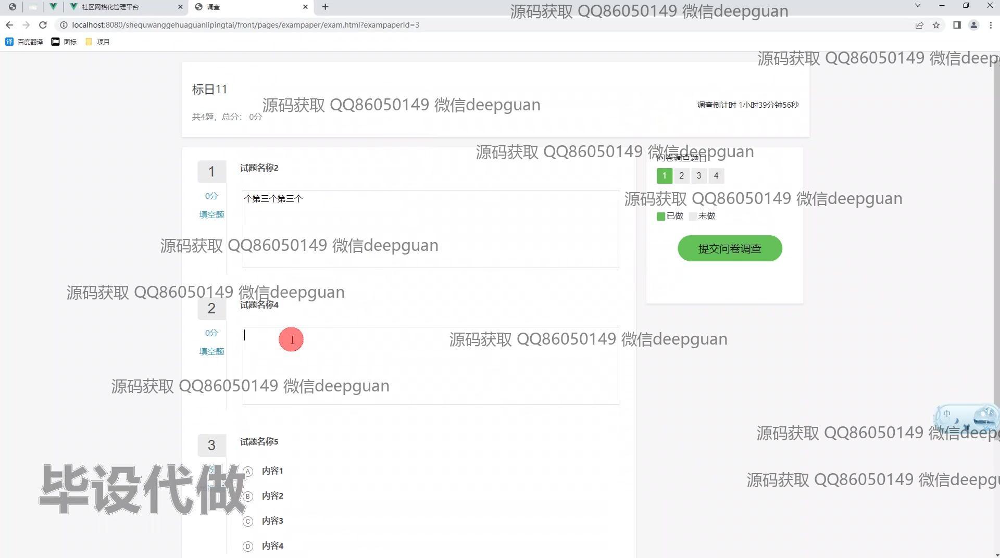
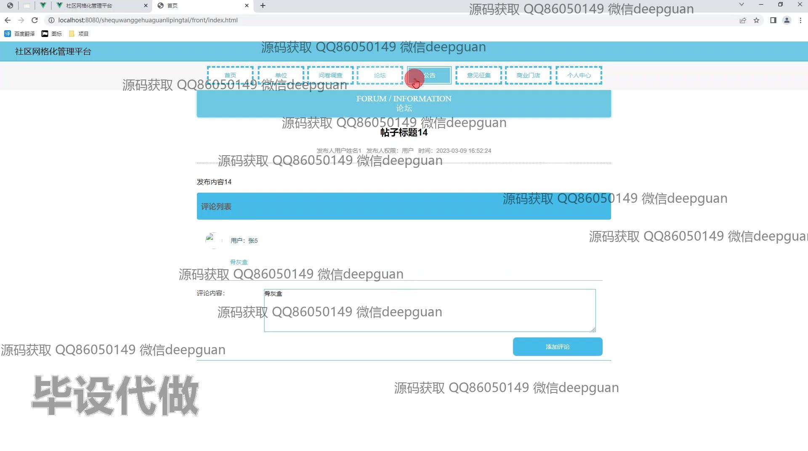
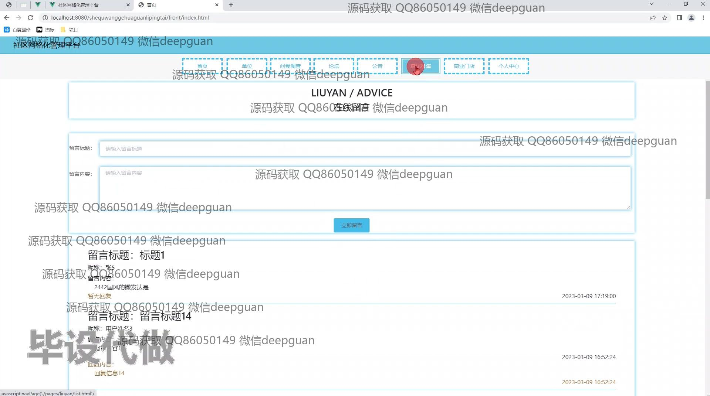
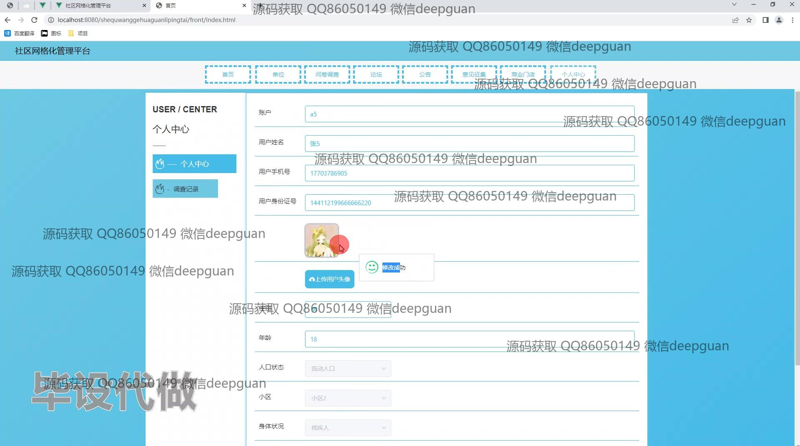
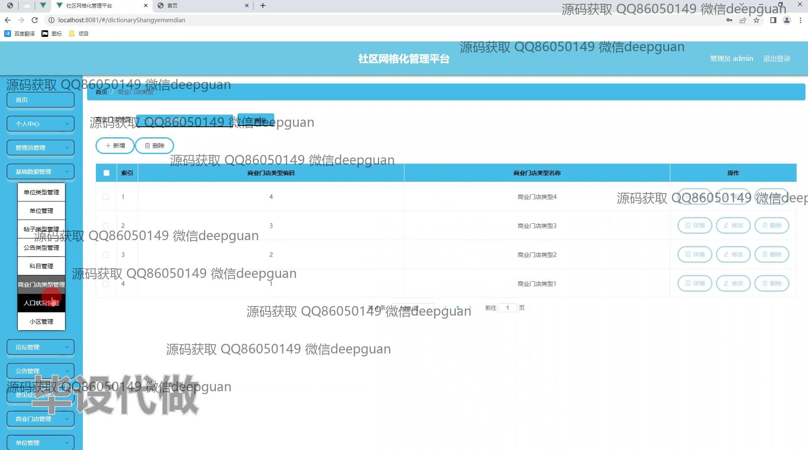

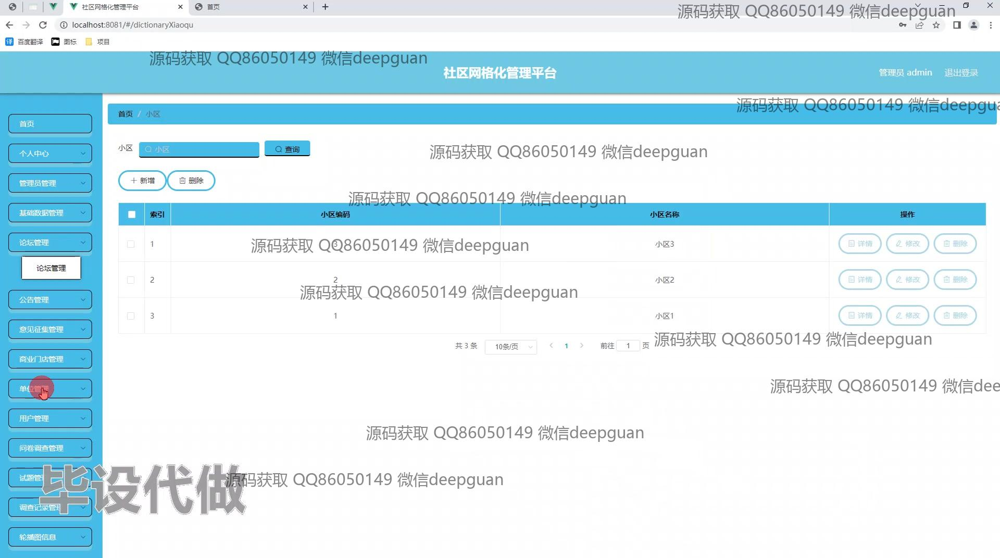
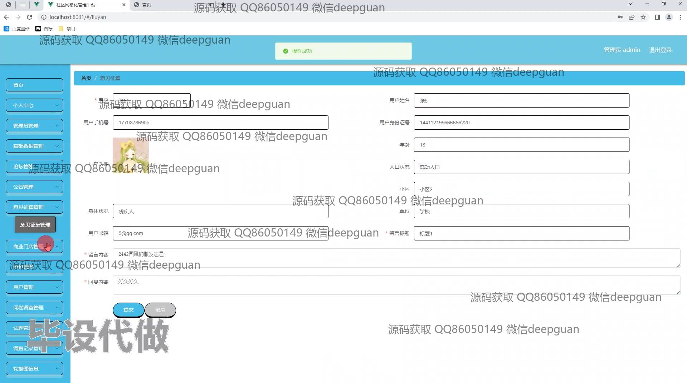
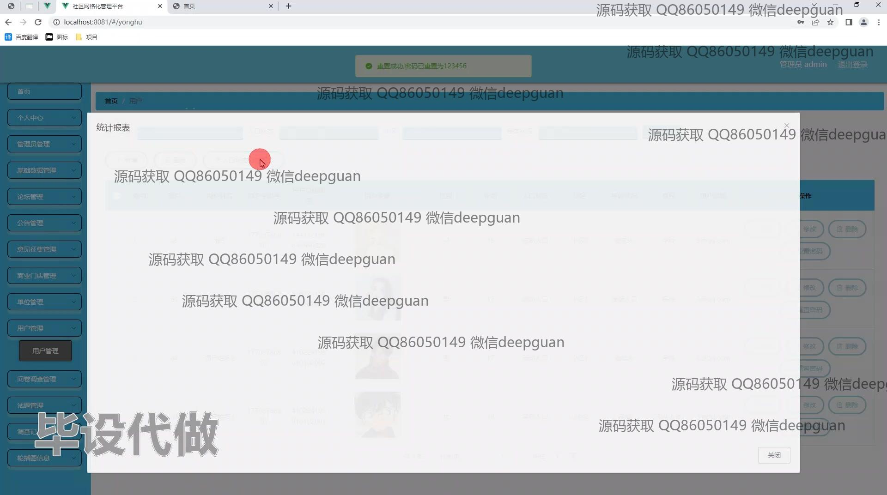
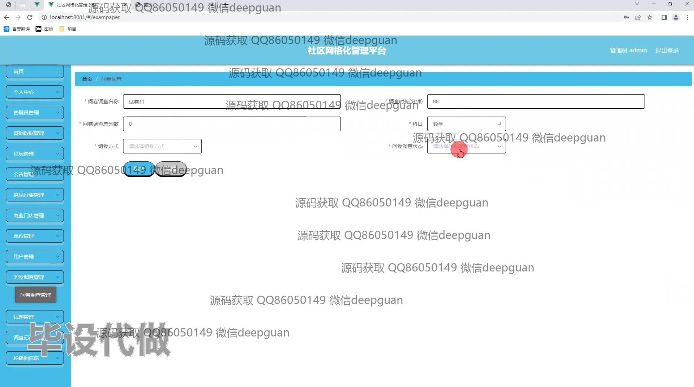
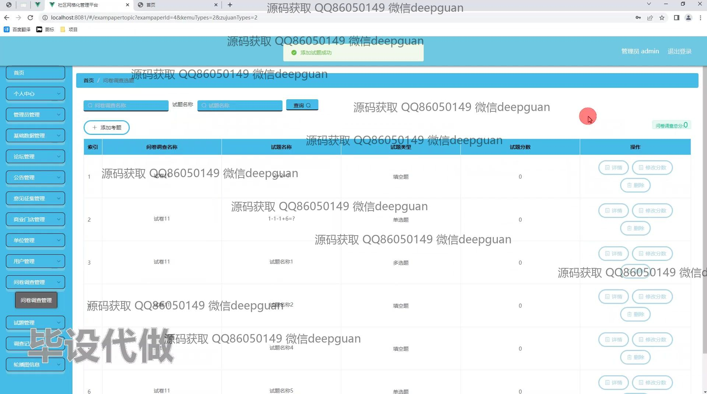
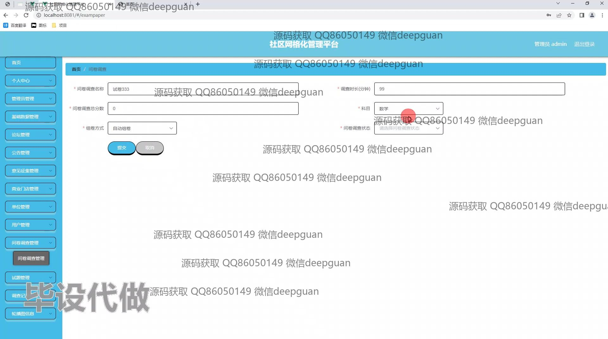
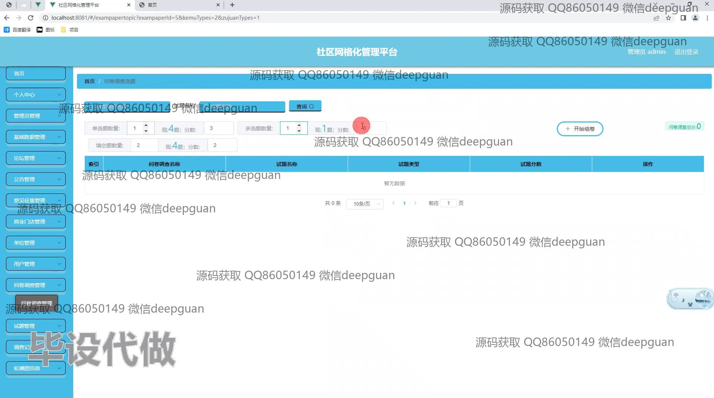
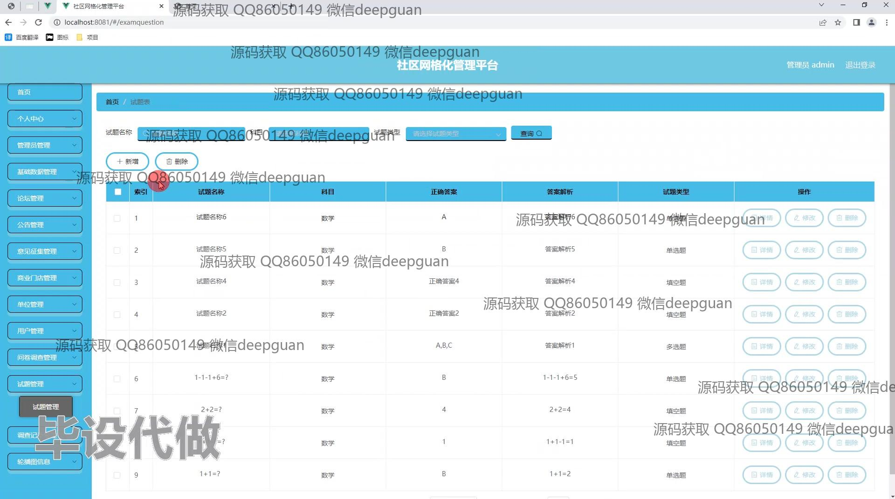
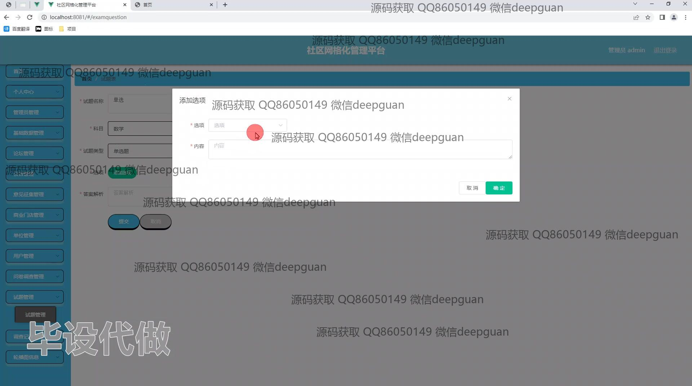
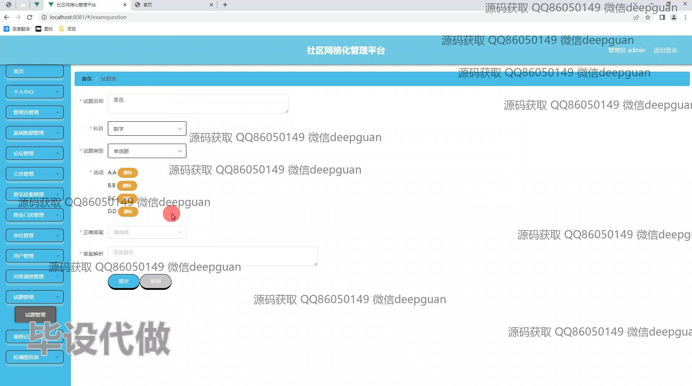
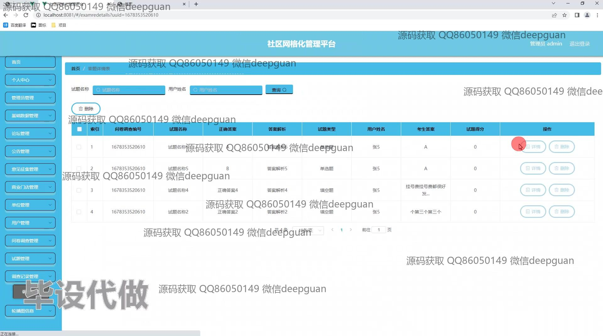

本代码来源于网络,仅供学习参考使用!

